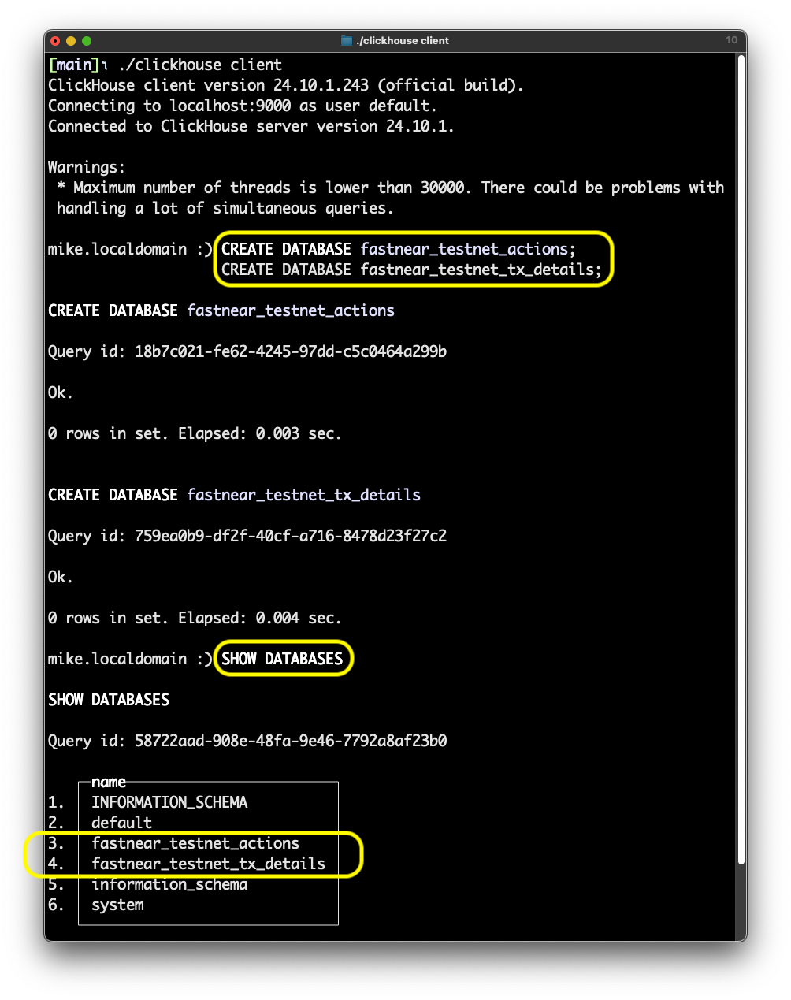
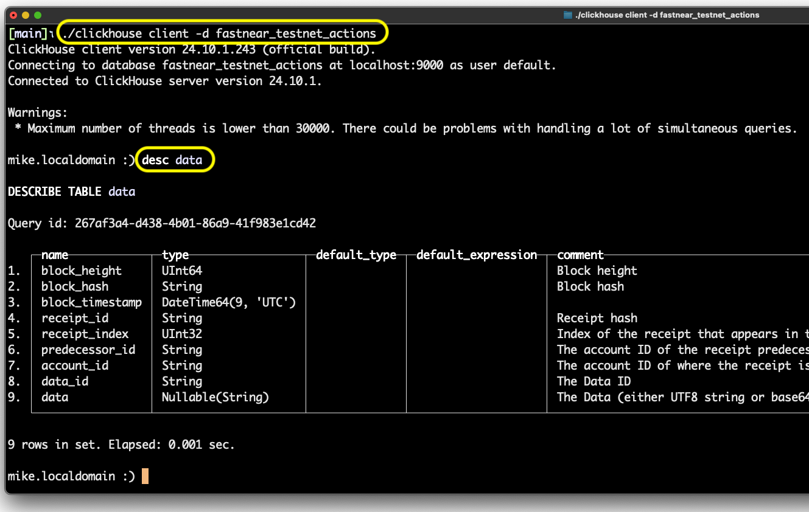

# FASTNEAR Clickhouse Provider

## Getting started

Clickhouse instructions taken from https://clickhouse.com/docs/en/getting-started/quick-start

The first command will create a binary, and it's best to navigate to the root directory of this project.

Run this command to build the binary:

    curl https://clickhouse.com/ | sh

Now run the binary passing "server" and our development config:

    ./clickhouse server --config-file clickhouse-info/config/config.xml

(**Ctrl + C** to exit)

Access the basic terminal client:

    ./clickhouse client

(**Ctrl + D** to exit)

Create two new databases (using the `:)` prompt in the `client`):

    CREATE DATABASE fastnear_testnet_actions;
    CREATE DATABASE fastnear_testnet_tx_details;

Show it for a sanity check:

    SHOW DATABASES

Your experience might/should look like this:



Next, we can import a script to create an example table that works for storing NEAR Protocol [Actions](https://nomicon.io/RuntimeSpec/Actions).

There are files in the `db-import` folder demonstrating schema creation. Let's exit the Clickhouse client with Ctrl + D. We'll execute the first script, creating all the tables necessary to index basic NEAR Actions.

    ./clickhouse client -d fastnear_testnet_actions --queries-file clickhouse-info/db-schemas/actions-events-data.sql

Let's use the client to confirm the import:

    ./clickhouse client -d fastnear_testnet_actions

Show the database tables, expecting `actions`, `data`, and `events`:

    SHOW TABLES

Describe the `data` table:

    DESC data

What you might expect to see from those commands:



Finally, let's import the other tables using another script. Press Ctrl + D to exit the client and run:

    ./clickhouse client -d fastnear_testnet_tx_details --queries-file clickhouse-info/db-schemas/transactions-accounts-blocks-receipts.sql

## File structure

Exploring the `clickhouse-info` directory:

```
.
├── config
│  └── config.xml
├── data (generated)
├── db-schemas
│  ├── actions-events-data.sql
│  └── transactions-accounts-blocks-receipts.sql
└── logs (generated)
├── clickhouse-server.err.log
└── clickhouse-server.log
```

When troubleshooting, you may look at the bottom of the `clickhouse-server.err.log` file, which is set to log in `debug` mode for local development.

## Connect to API

The next step is to follow the README instructions for this FastNEAR repository:

https://github.com/fastnear/explorer-api
